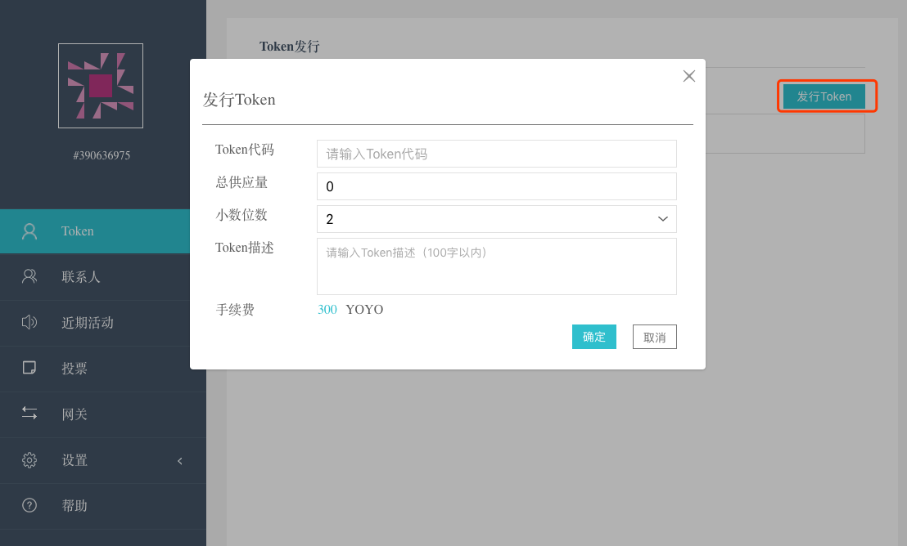

# User-Issued Assets (UIA)

YOYOW provides the feature of issuing assets, and common accounts can create and issue a variety of custom assets (UIA).

User-issued assets can be transferred in transactions, so they can be used as rewards for content platforms to replace the traditional point mechanism.

Later, the exchange relationship between YOYO and UIA will be introduced.

## Issuing Assets

The web wallet provides a simple operation for issuing assets, and it is convenient to specify the code for issuing the token, the total supply, and the number of decimal points. As shown below:

The fees for issuing assets include the basic fees and the cost per kilobyte. The basic fees are charged according to the length of the Token code. The current basic fees are as follows:

| Token Code Digits | Basic Fees | 
| :------: | ------: |
| 3 Digits | 30000 YOYO | 
| 4 Digits | 3000 YOYO | 
| 5 Digits or more | 300 YOYO | 

## Advanced Options
In addition to the simple feature of UIA, users issuing assets can define more features.

- Whitelist: Assets can optionally be whitelisted. If a whitelist is defined, only whitelisted accounts can hold and use assets.

- Blacklist: The asset enables the blacklist by default. The account in the blacklist cannot hold and use the assets.

- Forced transfers: Assets can be set to allow for forced transfers. If enabled, the issuer of the asset can force transfer or take back such assets in other people's accounts.

- Restricted transfers: Assets can be set to allow for restricted transfers. If enabled, the originator or recipient of the transfer must be the issuer of the assets.

- Issuance of assets: After the asset is created, it needs to be issued to the account for circulation. If enabled, the issuer of the asset can add a certain amount of such assets to an account. The issue means increasing the current circulation of the asset.

- Modifying the circulation limit: If enabled, the asset issuer can modify the circulation limit of the assets.

For more information, please refer to the API documentation for a detailed description of the request parameters in the [Creation of Assets](../api/wallet_api.html#create-asset).
